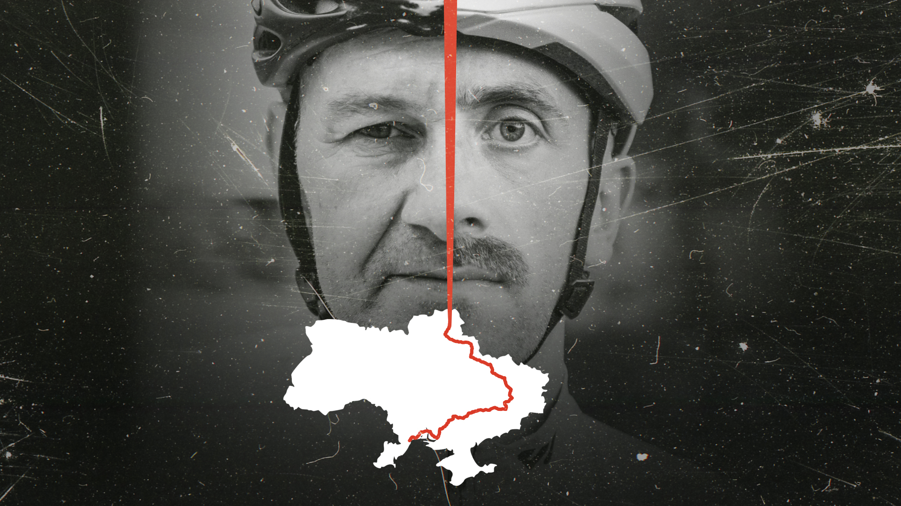

# Ride the Line

A film website for **Ride the Line**, a documentary about two cyclists riding 1,500 km along the frontline in Ukraine.

Live site: https://ride-the-line.vercel.app



## About

I built this as a focused landing page for the film. The goal was to make the site feel close to the story: bold first screen, quick trailer access, clear screening info, and space for sponsors and the director.

## Features

- Responsive hero section with separate desktop and mobile images
- Local trailer video opened in a modal
- Animated title text and bike animation
- Fixed screening bar with an expandable calendar
- Sponsor block and director section
- Static Next.js deployment on Vercel

## Tech Stack

- Next.js 15
- React 19
- Tailwind CSS 4
- Framer Motion and Motion Plus
- Lottie animation

## Run Locally

```bash
npm install
npm run dev
```

Open http://localhost:3000 in your browser.

For a production build:

```bash
npm run build
npm run start
```
